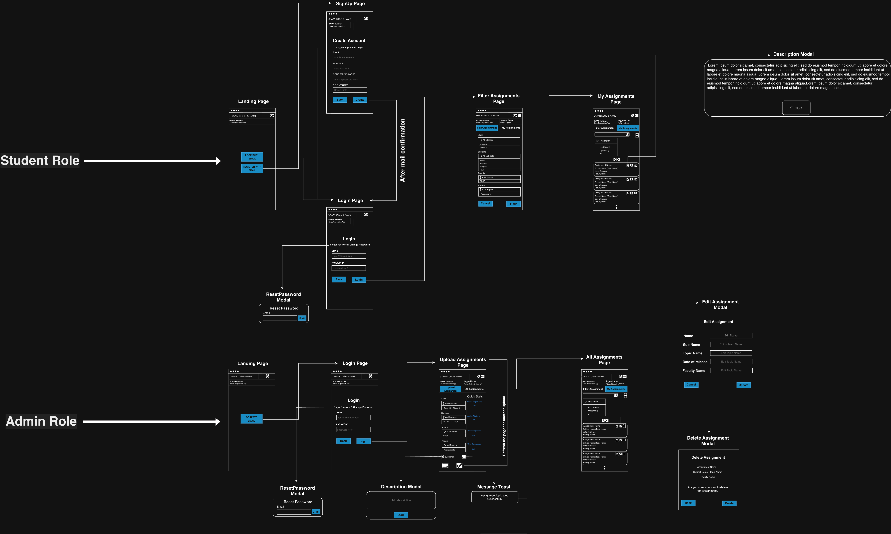

# SAMPLE PAPER APP (GYAANKOSH)
A modern web application for managing and accessing academic assignments and question papers, built using React(Vite framework), TypeScript, and Firebase.

## 1. OVERVIEW
GyaanKosh is designed for an educational institute to streamline the management and distribution of assignments. It provides role-based access for Students, Faculty, and Admins, ensuring secure and efficient interaction with academic resources.

## 1.1 LIVE DEMO
https://sample-paper-app-0.web.app/

# -----------------------------------------

## 2. WIRE FRAMES
Wireframes were created using draw.io to plan the layout, navigation flow, and user interactions before development.
These designs helped ensure:
- Responsive UI for mobile and desktop
- Clear user navigation
- Structured layout for role-based dashboards

### 2.1 DESKTOP VIEW

### 2.2 MOBILE VIEW

# -----------------------------------------

## 3. FEATURES
### 3.1 STUDENT
- Can view Assignments.
- Can preview PDFs directly in browser.
- Can download assignments.
- Can filter assignments by class, board, and subjects.

### 3.2 FACULTY
- Can upload assignments.
- Can edit assignment descriptions.
- Can delete assignments.
- Can manage academic content.

### 3.3 ADMIN
- Can have full control over assignments.
- Role-based Access Management.
- Advanced filtering capabilities.

### 3.4 AUTHENTICATION & SECURITY
- Firebase Authentication (Email/Password)
- Role-based Access Control (RBAC)
- Secure Firestore rules
- Password reset functionality (with security considerations)

# -----------------------------------------

## 4. INVITE-BASED FACULTY REGISTRATION
This app uses an invite-based registration flow for privileged roles such as **Faculty/Admin**. This ensures that only authorized users can create faculty/admin accounts in the system.

### 4.1 WHY THIS IS USED?
Instead of allowing anyone to self-register as faculty/admin, the application requires an **admin-generated invite token**. This improves access control and prevents unauthorized users from registering with elevated privileges.

### 4.2 ADMIN WORKFLOW
- Admin generates an invite token for a faculty member or another admin member.
- The system creates a registration link containing the token.
- Admin shares this link with the intended faculty/admin member.

Example: `/signup?invite=TOKEN_VALUE`

### 4.3 FACULTY WORKFLOW
- Faculty opens the invite link recieved from the admin.
- The signup page reads the token from the URL.
- During signup, the token is validated.
- If the token is unused, valid, or unexpired, the user account is created with the **faculty** role.
- The token is then marked used.

### 4.4 IMPLEMENTATION NOTES
- Invite tokens are stored in Firestore(collection name - **Invites**).
- Each token contains metadata such as role, createdAt, expiredAt, issuedBy, usedBy
- The signup flow validates the token before assigning the faculty role. 

### 4.5 SECURITY NOTES
- Tokens are single-use
- Tokens can have an expiration time.
- Only admin-issued tokens can assign privileged roles.
- This reduces the risk of unauthorized role escalation.

# -----------------------------------------

## 5. FACULTY FIRST-TIME ONBOARDING
After a faculty members signsup through the invite-bases signup flow and logs in for the first time, the app displays a modal form to complete the faculty profile. This onboarding step is implemented using the `FacultyProps.tsx` component.

### 5.1 COLLECTED INFORMATION
The modal collects the following information:
- Name
- Email
- AssignedClass
- AssignedBoard
- Assigned Subject

### 5.2 PURPOSE
This first-time onboarding flow ensures that faculty-specific metadata is captured before the user starts interacting with the system.

It helps the application:
- associate faculty members with their academic responsibilities
- support assignment upload and filtering workflows
- maintain structured faculty records in the database

### 5.3 WORKFLOW
- Faculty receives an admin-generated invite link
- Faculty registers and logs into the application
- On first login, the onboarding modal is shown
- Faculty fills in the required academic details
- The information is stored and linked to the faculty account
- Subsequent logins skip this onboarding step

### 5.4 IMPLEMENTATION STEPS
- The onboarding modal is triggered only for faculty users
- It is displayed only during the first login or until the required profile information is completed
- The captured data is used for role-based workflows across the application

# -----------------------------------------

## 6. TECH STACK
### 6.1 FRONTEND
- React(Vite)
- Typescript
- Chakra UI

### 6.2 BACKEND/SERVICES
- Firebase Authenitcation
- Firestore Database
- Firebase Storage
- Firebase Hosting

# -----------------------------------------

## 7. SETUP & INSTALLATION
### 7.1 CLONE THE REPOSITORY
    git clone [<repo-url>](https://github.com/kumar-abhinav393/SamplePaperApp.git)
    cd sample-paper-app

### 7.2 INSTALL DEPENDENCIES
    npm install

### 7.3 ADD ENVIRONMENT VARIABLES
    VITE_FIREBASE_API_KEY=firebase_key
    VITE_FIREBASE_STORAGE_BUCKET=firebase_bucket

### 7.4 RUN THE APP LOCALLY
    npm run dev

# --------------------------------------------------------------------------------------------------

## 8. DEPLOYMENT
### 8.1 BUILD
    npm run build

### 8.2 DEPLOY
    firebase deploy

# --------------------------------------------------------------------------------------------------

## 9. VERSIONING
This project follows semantic versioning:

vMAJOR.MINOR.PATCH
	•	v1.0.0 → Initial stable release
	•	v1.1.0 → New features
	•	v1.0.1 → Bug fixes

Development version use: 1.1.0-SNAPSHOT

# --------------------------------------------------------------------------------------------------

## 10. KNOWN LIMITATIONS
	•	Mobile PDF download behavior depends on browser capabilities.
	•	Password reset flow requires rate limiting and CAPTCHA for enhanced security.